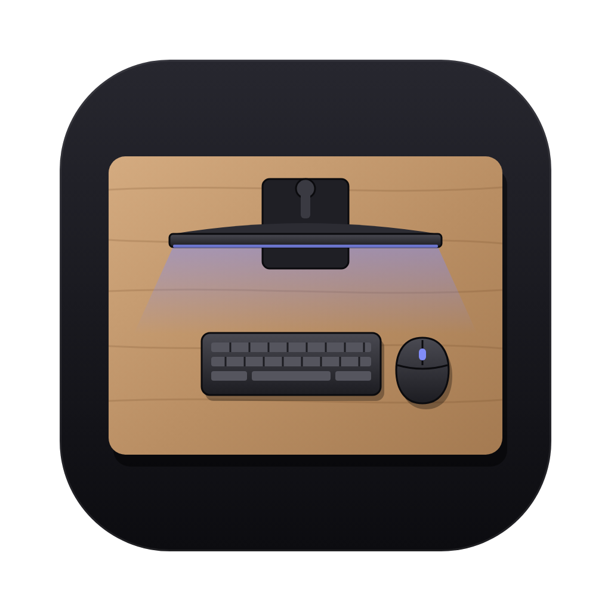
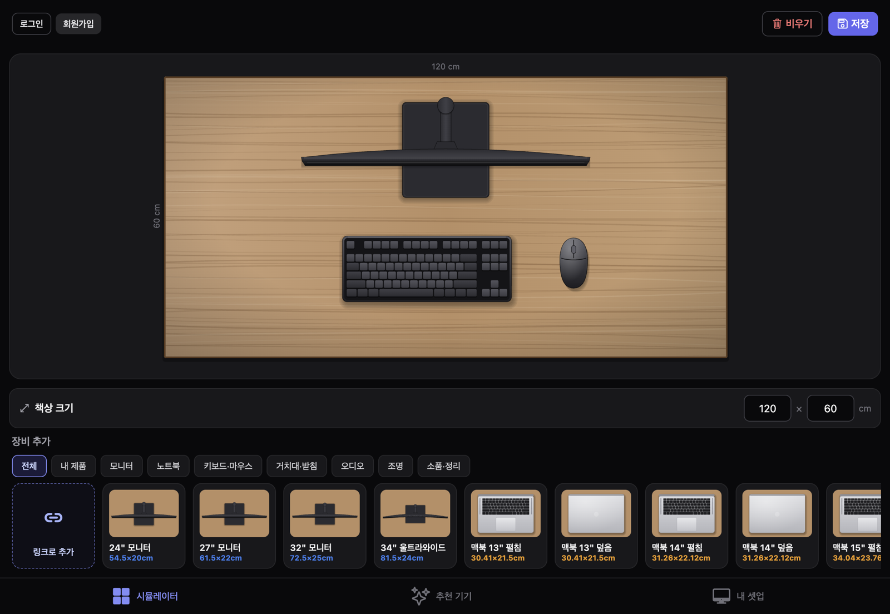
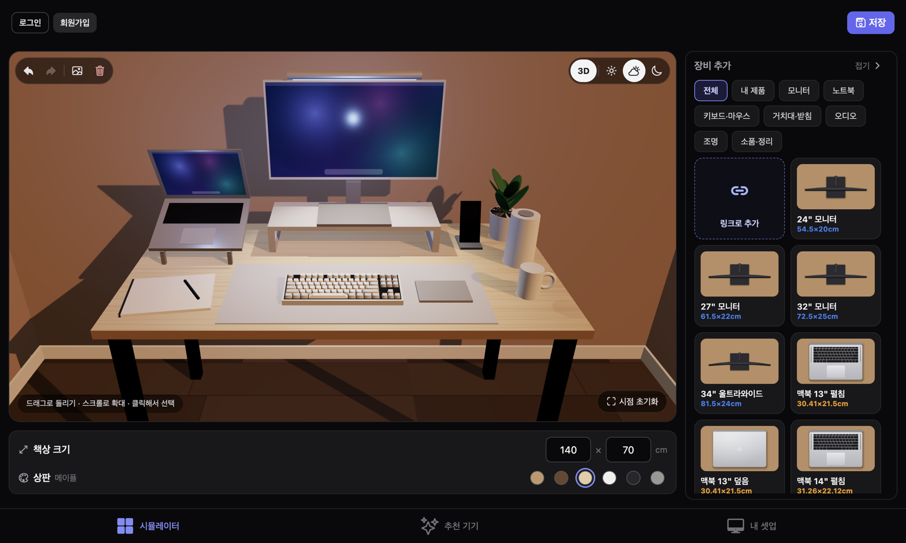

<div align="center">



# DeskBoard

데스크보드 · 실제 치수 기반의 데스크 셋업 시뮬레이터

[](https://github.com/dgim9390/DeskBoard/releases/latest)
[](https://deskterior-one.vercel.app)

[](https://github.com/dgim9390/DeskBoard/releases/latest)
_|_Web-000000?style=flat-square)




</div>

## 개요

DeskBoard(데스크보드)는 책상과 장비를 실제 크기(cm)로 배치해 데스크 셋업을 미리 구성해 보는 애플리케이션입니다.
위에서 내려다본 2D 편집 화면과 3D 보기를 함께 제공하며, 제품 페이지 링크만으로 실제 제품을 불러와 배치할 수 있습니다.
macOS 앱과 웹에서 동일하게 동작하고, 로그인하면 저장한 셋업이 기기 간에 동기화됩니다.



## 주요 기능

| 구분 | 기능 | 설명 |
| --- | --- | --- |
| 배치 | 실제 치수 편집 | 책상 크기와 장비 크기를 cm 단위로 입력하고 실제 비율로 배치 |
| | 자유 편집 | 이동, 크기 조절, 회전, 앞뒤 순서, 색상, 복제, 중앙 정렬 가이드 |
| | 장비 결합 | 모니터 암, 노트북 받침대, 수직 거치대를 장비와 결합하거나 분리 |
| | 실행 취소 | 모든 편집에 대해 실행 취소 및 다시 실행 |
| 시각화 | 3D 보기 | 2D 화면과 3D 화면을 전환하고, 회전 및 확대로 셋업을 확인 |
| | 상판 및 조명 | 상판 재질 6종, 조명 3종(낮, 저녁, 밤) |
| 제품 | 링크로 추가 | 제품 페이지에서 이름, 대표 사진, 크기(가로 × 깊이 × 높이)를 자동으로 추출 |
| | 배경 제거 | 단색 배경의 제품 사진에서 배경을 제거하고 제품 영역만 사용 |
| | 사진 선택 | 페이지 내 다른 사진을 선택하거나 직접 이미지 파일을 업로드 |
| | 추천 | 완성된 셋업 템플릿과 현재 책상 구성에 맞춘 제품 추천 |
| 저장 | 셋업 저장 | 계정에 저장해 macOS 앱, 웹, 다른 기기에서 동일하게 사용 |
| | 이미지 내보내기 | 2D 또는 3D 화면을 PNG 파일로 저장 |

## 설치

**macOS (Apple Silicon 전용, M1 이후 모델)**

1. [Releases](https://github.com/dgim9390/DeskBoard/releases/latest) 페이지의 Assets에서 `DeskBoard-x.x.x-arm64.dmg`를 다운로드합니다.
2. `.dmg` 파일을 열고 DeskBoard를 Applications 폴더로 드래그합니다.
3. 응용 프로그램 폴더에서 DeskBoard를 실행합니다.

**웹**

별도 설치 없이 [deskterior-one.vercel.app](https://deskterior-one.vercel.app)에서 사용할 수 있습니다.

### 앱이 열리지 않는 경우

Apple 공증을 거치지 않은 개인 배포 앱이므로, 처음 실행할 때 macOS 보안 경고가 표시됩니다. 아래 절차로 한 번만 허용하면 이후에는 정상적으로 실행됩니다.

1. 경고 창에서 **완료**를 선택합니다. (**휴지통으로 이동**은 선택하지 않습니다.)
2. **시스템 설정** → **개인정보 보호 및 보안**으로 이동합니다.
3. 화면 하단으로 스크롤한 뒤 **그래도 열기**를 선택합니다.
4. 비밀번호를 입력하고 **열기**를 선택합니다.

"손상되었기 때문에 열 수 없습니다"라는 메시지가 표시되고 **그래도 열기** 항목이 없다면, 터미널에서 다음 명령을 실행한 뒤 다시 엽니다.

```bash
xattr -dr com.apple.quarantine /Applications/DeskBoard.app
```

## 업데이트

| 종류 | 방법 |
| --- | --- |
| 화면 업데이트 | 앱 실행 시 표시되는 알림에서 **지금 적용**을 선택합니다. 메뉴 막대의 **DeskBoard → 업데이트 확인…**으로 직접 확인할 수도 있습니다. |
| 앱 업데이트 | 새 버전의 `.dmg`를 내려받아 Applications 폴더로 드래그하고 **대치**를 선택합니다. 기존 앱을 삭제할 필요는 없습니다. |

저장한 셋업, 로그인 정보, 내 제품 목록은 업데이트 후에도 유지됩니다.

> [!NOTE]
> 1.3.0부터 앱 이름이 Deskterior에서 **DeskBoard**로 바뀌었습니다. 새 버전을 설치한 뒤 응용 프로그램 폴더에 남은 Deskterior 앱은 휴지통으로 옮겨도 되며, 저장한 데이터는 그대로 유지됩니다.

## 사용 안내

### 링크로 제품 추가

- 제조사 공식 홈페이지의 제품 상세 페이지 링크를 권장합니다. (예: Apple, Logitech, Keychron, Xbox)
- 쿠팡, 네이버 스마트스토어 등 자동 수집을 차단하는 쇼핑몰 링크는 지원하지 않습니다. 이 경우 이름과 크기를 직접 입력하고, 상품 이미지를 저장한 뒤 **사진 올리기**로 등록합니다.
- 제품 페이지에 치수가 기재되어 있으면 가로, 깊이, 높이가 자동으로 입력됩니다. 높이는 3D 보기에 사용되며, 비워 두면 제품 종류에 따라 자동으로 결정됩니다.

### 단축키

| 키 | 동작 |
| --- | --- |
| `⌘Z` / `⌘⇧Z` | 실행 취소 / 다시 실행 |
| `⌘D` | 선택한 장비 복제 |
| `⌫` | 선택한 장비 삭제 |
| `←` `↑` `→` `↓` | 1cm 이동 (`⇧`와 함께 누르면 5cm) |
| `⌘S` | 셋업 저장 |
| `esc` | 선택 해제 |

### 화면 구성

| 화면 | 내용 |
| --- | --- |
| 시뮬레이터 | 책상 편집 화면과 장비 추가 패널. 넓은 화면에서는 패널이 오른쪽에 표시되며 접을 수 있습니다. |
| 추천 기기 | 셋업 템플릿과 현재 책상 구성에 맞춘 추천 제품 |
| 내 셋업 | 저장한 셋업 불러오기, 덮어쓰기, 삭제 |

## 개발

### 실행

```bash
npm install
npx expo start                 # w: 웹, i: iOS 시뮬레이터
```

### macOS 앱 빌드

```bash
cd desktop
npm install
npm run dist                   # desktop/release/*.dmg 생성
```

### 환경 설정

- `.env.example`을 복사해 `.env`를 만들고 Supabase 프로젝트 URL과 공개 키를 입력합니다.
- 데이터베이스 스키마는 `supabase/schema.sql`에 있습니다.

### 구조

| 경로 | 역할 |
| --- | --- |
| `app/` | 화면 구성 (Expo Router) |
| `components/` | UI 컴포넌트 (캔버스, 장비 패널, 3D 보기 등) |
| `store/` | 상태 관리 및 로컬 저장, 계정 동기화 (Zustand) |
| `lib/desk3d/` | 3D 장면과 제품 모델 (three.js) |
| `lib/cutout.ts` | 제품 사진 배경 제거 |
| `api/` | 제품 페이지 분석, 이미지 중계 (Vercel 서버리스 함수) |
| `desktop/` | macOS 앱 (Electron) 및 자동 업데이트 |

### 기술 스택

Expo (React Native, Expo Router) · NativeWind · Zustand · Reanimated · three.js · Supabase · Vercel · Electron
